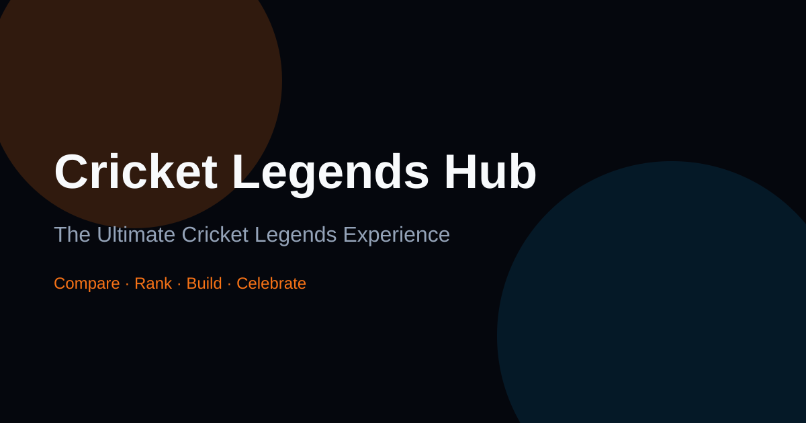

# Cricket Legends Hub

<p align="center">
  
</p>

<p align="center">
  <strong>The Ultimate Cricket Legends Experience</strong><br/>
  Premium product-grade web app for exploring cricket’s greatest players, records, and moments.
</p>

<p align="center">
  <a href="#features">Features</a> ·
  <a href="#tech-stack">Tech Stack</a> ·
  <a href="#quick-start">Quick Start</a> ·
  <a href="#architecture">Architecture</a> ·
  <a href="#deployment">Deployment</a>
</p>

---

## Overview

Cricket Legends Hub is a full-stack MERN experience redesigned as a **portfolio-ready product**:

- Glassmorphism UI with aurora backgrounds and motion
- Offline-first curated legends dataset + optional live API
- GOAT calculator, head-to-head compare, hall of fame rankings
- Dream team builder, quiz, match archive, cricket timeline
- Dark / light / system themes, command palette, PWA support
- SEO metadata, sitemap, robots, structured data

Built for fans, recruiters, and engineers who care about craft.

---

## Features

| Area | Capabilities |
|------|----------------|
| **Legends** | Browse, filter, sort, favorites, detailed profiles |
| **Compare** | Head-to-head metrics + interactive bar charts |
| **Hall of Fame** | Transparent GOAT ranking model |
| **Dream Team** | Build & persist an XI in local storage |
| **Quiz** | 10-question legend knowledge test with best score |
| **Records** | Batting / bowling / team milestones |
| **Matches** | Historic encounter archive |
| **Timeline** | Cricket history from 1877 → modern era |
| **GOAT Lab** | Transparent weighted calculator with live breakdown |
| **Countries** | Nation-level aggregate stats and legend chips |
| **Export** | CSV/JSON download + print-friendly profiles |
| **UX** | ⌘K palette, reading mode, scroll progress, keyboard jumps, reduced motion |
| **PWA** | Installable manifest + service worker (production) |

---

## Tech Stack

**Frontend:** React 18 · Vite 5 · Tailwind CSS · Framer Motion · Recharts · Lucide · React Router  
**Backend:** Node.js · Express · MongoDB · Mongoose · JWT · Helmet · Rate limiting  
**Quality:** Modular architecture · Design tokens · Lazy routes · Code splitting · Accessibility-first markup

---

## Quick Start

### Prerequisites

- Node.js 18+
- MongoDB (optional for frontend-only; required for API auth/CRUD)

### Frontend (works offline with curated data)

```bash
cd frontend
npm install
npm run dev
```

Open **http://localhost:5173**

### Backend (optional API)

```bash
cd backend
cp .env.example .env   # or use existing .env
npm install
npm run seed
npm run dev
```

API: **http://localhost:5000/api**

Seeded accounts:

- Admin: `admin@cricketlegends.com` / `admin123`
- Demo: `demo@cricketlegends.com` / `demo123`

---

## Architecture

```
Cricket-Legends-Hub/
├── frontend/
│   ├── public/                 # PWA, SEO, icons
│   └── src/
│       ├── animations/         # Motion variants
│       ├── components/
│       │   ├── charts/         # Recharts wrappers
│       │   ├── effects/        # Aurora, progress, back-to-top
│       │   ├── layout/         # Navbar, Footer, shell
│       │   ├── legends/        # Cards, filters
│       │   ├── search/         # Command palette
│       │   └── ui/             # Design system primitives
│       ├── config/             # Site config, nav
│       ├── context/            # Theme + app state
│       ├── data/               # Curated legends dataset
│       ├── hooks/              # Motion, counters
│       ├── pages/              # Route screens
│       ├── styles/             # Design tokens
│       └── utils/              # Format, GOAT, storage, cn
└── backend/
    ├── config/ controllers/ middleware/ models/ routes/
    ├── seed.js
    └── server.js
```

---

## Keyboard Shortcuts

| Shortcut | Action |
|----------|--------|
| `⌘/Ctrl + K` or `/` | Open command palette |
| `Esc` | Close palette |
| `T` | Cycle theme |
| `G` then `H/L/C/F/D/Q/O/N` | Jump Home / Legends / Compare / HoF / Dream / Quiz / GOAT / Nations |
| Reading mode button | Narrow content column for focus |

---

## Deployment

### GitHub Pages

Workflow sets `VITE_BASE=/Cricket-Legends-Hub/` and publishes `frontend/dist`.

### Vercel / Netlify / Cloudflare Pages

- **Root:** `frontend`
- **Build:** `npm run build`
- **Output:** `dist`
- **Base path:** `/` (default)

SPA fallback: redirect all routes to `index.html`.

---

## Scripts

```bash
# Frontend
npm run dev
npm run build
npm run preview

# Backend
npm run dev
npm run seed
npm start
```

---

## Documentation

See [`docs/`](./docs/) for:

- Architecture
- Design system
- Performance / SEO / Accessibility notes
- Deployment guide
- Changelog

---

## Author

**Vivek Kumar Verma**  
GitHub: [@VivekGitNinja](https://github.com/VivekGitNinja)  
Email: vkumarverma670@gmail.com

---

## License

MIT

---

*v2.0.0 — Premium redesign · July 2026*
